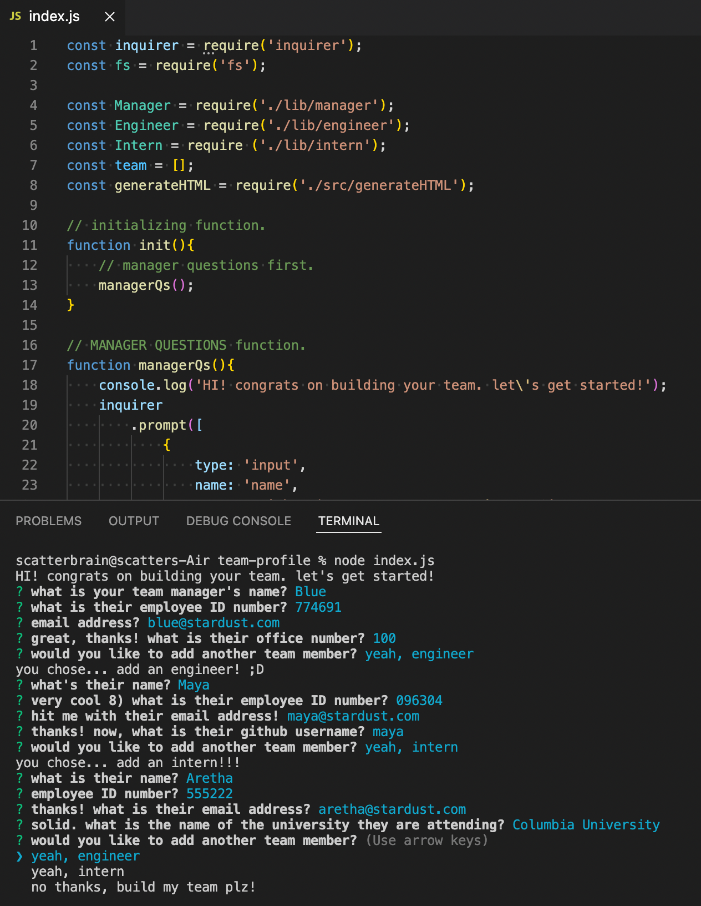
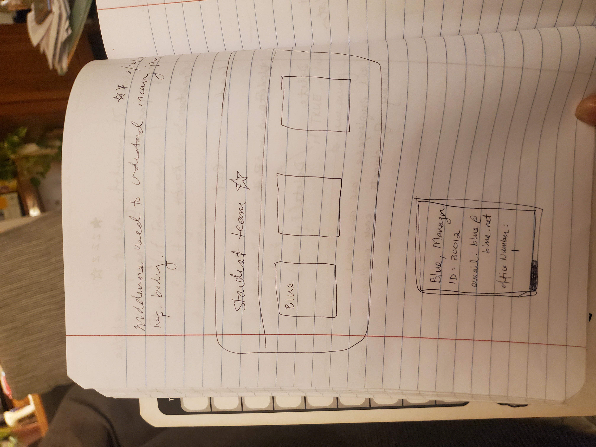
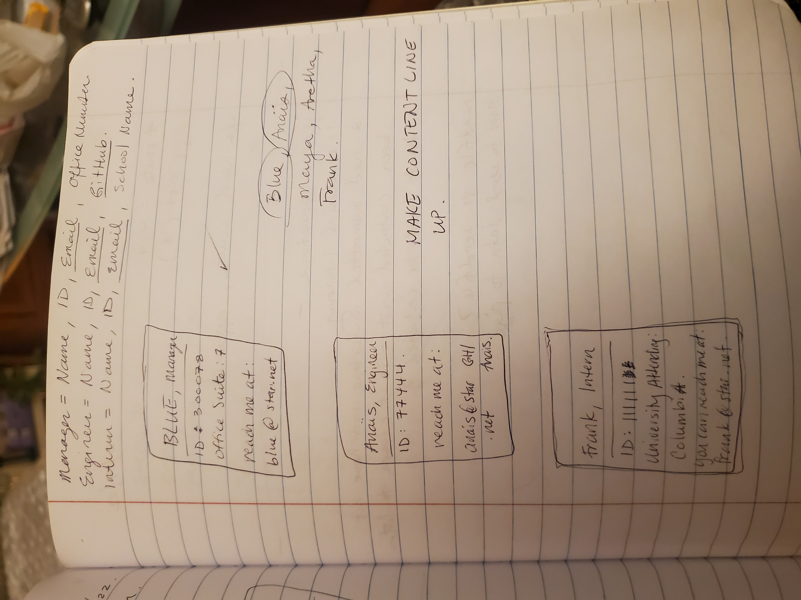

# Team Profile Generator

Meet the stardust team! This command-line application takes in information about employees on a software engineering team, called stardust✪, and generates an HTML page that displays information about each employee.

## Table of Contents

- [Installation](#installation)
- [Usage](#usage)
- [Processes](#processes)
- [Credits](#credits)
- [License](#license)

## Installation

In order to properly run this application, you will need to clone the repository, run Node, and install Jest and Inquirer.

## Usage

After cloning the repository, install Jest and Inquirer by running ```npm i jest``` and ```npm i inquirer```. Now, you can run some tests! Use ```npm run test``` to see that all tests pass with flying colours! Tests are vital to keeping code maintainable.

Run ```node index.js``` or ```npm start``` to get the questions rolling. You will be prompted for information about the Team Manager and given options to continue building your team or finish up. Team members you can add are Engineer and Intern. Information gathered about each employee includes assets like name, ID #, email address, office number, GitHub username, and name of university. Some information is repeated throughout each employee prompt because each employee needs a standard set of information about them!

After answering all the questions and adding all the team members you'd like, the application will create a file named under 'index.html' for you! Employee information is soundly displayed in individual cards against a blue background.


P.S. stardust rules!



This image is what the majority of Terminal will look like when questions are prompted. Input from the questions are generated onto the HTML page.

View this walkthrough [video](https://drive.google.com/file/d/1Qz7S0mR4EDm4lQN4_fx9eStFh4r9aE34/view) to learn and explore more about the application.

## Processes

The setup of the application uses Inquirer to prompt questions in Terminal. When ```node index.js``` is run, the initial question set is for manager. Respones to the questions are logged and pushed to an overarching array. Then, the next question set is a list of options to add a team member. This prompt comes after every added team member. The process for adding engineer and intern are similar to manager, until the user decides to finish building their team. A function to write file is called, and this is when the HTML will begin to generate, using the information stored in the said array.

The generate HTML function works by looping through the aforementioned array and finding a variable that matches the result of getRole() for manager, engineer, or intern. Depending on the result of getRole(), a.k.a. the employee's role or type of employee, a function is then called to generate HTML specifically for the employee/role.

Template literal is used to format the basic HTML page that includes a variable in the middle of the body, within a container, where all of the employees' information will be displayed. The variable is set as an array so that each employee Function can push to the array and all of the information between each employee will be gathered together in a single area/container.

Each employee has a specified function that sets up an HTML layout using template literal. Placeholders are used within the template literals to grab specified information about the employee, such as name, ID, email, etc. The template literals are set to variables, and the variables are pushed to the CONTENT array that was set within the HTML body.

The content is then joined to properly format all of the elements into a string.

After the generate HTML function has done its work and we have all our HTML layout set up, then, another function, the function that was writing the file, will now write the file.

Here are some wireframes for how I planned on styling the HTML content, how the information would be displayed in each employee card:





## Credits

Bootstrap, Google Fonts, Jest npm, Inquirer npm.

## License

Copyright (c) 2022 stardust productions.

Licensed under the MIT License.